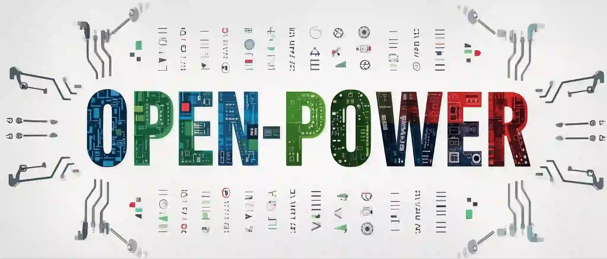

  

其它语言：[English](README.md), (Currently unable to translate more)

# open-power

本仓库用于记录在生产力/性能/稳定/设计等因素中，有某一方面处于优良水平的开源项目。你可以在这里最快速的找到面向生产的选择，我们提倡快速完成自己的工作，而不是去研究细枝末节。

功能重复的项目，我们往往只会记录1-2个，我们并不觉得列出所有同类型的开源项目有什么意义。

我们的评判原则是：简单 > 复杂；易用 > 专业；稳定 > 性能；

包括但不限于人工智能，区块链，图形图像，算法，开发工具，运维工具，各类协议，字体，文档的收集。

# index

<!-- TOC -->
* [open-power](#open-power)
* [index](#index)
* [AI](#ai)
  * [开箱即用](#开箱即用)
  * [生成式AI模型](#生成式ai模型)
    * [图像生成](#图像生成)
      * [图片生成](#图片生成)
      * [视频生成](#视频生成)
    * [大语言模型&多模态模型](#大语言模型多模态模型)
  * [工具库](#工具库)
  * [算法框架](#算法框架)
* [DEV](#dev)
  * [协议](#协议)
    * [RPC](#rpc)
  * [数据库](#数据库)
  * [Golang](#golang)
    * [基础能力](#基础能力)
    * [工具库](#工具库-1)
    * [HTTP](#http)
    * [容器能力](#容器能力)
    * [Gui](#gui)
    * [操作系统接口](#操作系统接口)
    * [开箱即用](#开箱即用-1)
    * [开发工具](#开发工具)
  * [爬虫](#爬虫)
    * [定向爬虫](#定向爬虫)
  * [Android](#android)
    * [工具库](#工具库-2)
* [Font](#font)
* [Protocol document link](#protocol-document-link)
<!-- TOC -->

# AI

## 开箱即用

| 项目简要                                                                                  | 主要功能     | 地址（点击访问）                                                                           | 使用许可证                                 |
|---------------------------------------------------------------------------------------|----------|------------------------------------------------------------------------------------|---------------------------------------|
| Stable-diffusion-webui可以一键构建AI画图的web页面，让AI画图变得简单，使用插件也具备视频生成功能，目前生态已经非常丰富，社区存在大量优秀插件。 | 图像生成     | [stable-diffusion-webui](https://github.com/AUTOMATIC1111/stable-diffusion-webui)  | [AGPL 3.0](#Protocol-document-link)   |
| 这是一个生产级别低代码节点编辑的AI流程编辑软件。社区存在大量的流程模版与插件。                                              | AI工作流    | [ComfyUI](https://github.com/comfyanonymous/ComfyUI)                               | [GPL 3.0](#Protocol-document-link)    |
| 比UVR5-UI更强大的音频处理整合项目，作者目前仍在活跃（截止到20241117）。                                           | 音频分离/降噪  | [MSST-WebUI](https://github.com/SUC-DriverOld/MSST-WebUI)                          | [AGPL 3.0](#Protocol-document-link)   |
| 一个经典的脸部替换项目，请注意法律风险。                                                                  | 图像处理     | [DeepFaceLive](https://github.com/iperov/DeepFaceLive)                             | [GPL 3.0](#Protocol-document-link)    |
| 相对于大多数停更的SVC项目，RVC的作者仍在活跃，开箱即用。                                                       | 音色转化     | [RVC-WebUI](https://github.com/RVC-Project/Retrieval-based-Voice-Conversion-WebUI) | [MIT](#Protocol-document-link)        |
| 基于langchain的大语言模型llm项目，支持RAG和Agent相关功能（Langchain-ChatGLM的改进项目）。                       | 类ChatGPT | [Langchain-Chatchat](https://github.com/chatchat-space/Langchain-Chatchat)         | [Apache 2.0](#Protocol-document-link) |
| 一个开箱即用的仿ChatGPT项目（基于API的），功能支持较多，如果你想快速落地一个类ChatGPT项目，或许这是首选。                         | 类ChatGPT | [open-webui](https://github.com/open-webui/open-webui)                             | [MIT](#Protocol-document-link)        |

## 生成式AI模型

### 图像生成

#### 图片生成

| 项目简要                                                                                                              | 地址（点击访问）                                                                                        | 使用许可证                                               |
|-------------------------------------------------------------------------------------------------------------------|-------------------------------------------------------------------------------------------------|-----------------------------------------------------|
| stable diffusion v1-5 是CompVis原始版本的改进版本，目前仍是工具链最完善的图像底座模型没有之一。（截止到20241117）                                       | [stable-diffusion v1-5](https://huggingface.co/stable-diffusion-v1-5/stable-diffusion-v1-5)     | [CreativeML Open RAIL-M](#Protocol-document-link)   |
| stable-diffusion-xl-base-1.0 由stabilityai开发的sd高清版本，虽然出现了一些比较新的技术，但关于相关工具链，例如controlnet等的完善程度仅次于sd1.5（截止到20241117） | [stable-diffusion-xl-base-1.0](https://huggingface.co/stabilityai/stable-diffusion-xl-base-1.0) | [CreativeML Open RAIL++-M](#Protocol-document-link) |

#### 视频生成

| 项目简要                   | 地址（点击访问）                                      | 使用许可证                                |
|------------------------|-----------------------------------------------|--------------------------------------|
| CogVideo由清华大学发布的视频生成模型 | [CogVideo](https://github.com/THUDM/CogVideo) | [多种协议](https://huggingface.co/THUDM) |

### 大语言模型&多模态模型

多模态模型通常是基于大语言模型的改造版本

| 项目简要                                                      | 多模态    | 地址（点击访问）                               | 使用许可证                                                                             |
|-----------------------------------------------------------|--------|----------------------------------------|-----------------------------------------------------------------------------------|
| llama由meta发布的大语言模型，但支持的语言较少，目前是最火的大语言底座模型之一。（截止到20241117） | 部分版本   | [Llama](https://www.llama.com/)        | [独立协议](https://www.llama.com/docs/how-to-guides/responsible-use-guide-resources/) |
| qwen由阿里发布的大语言模型，包含图片理解，音频理解，数学，代码优化版本。                    | 有多模态版本 | [QwenLM](https://github.com/QwenLM)    | [多种协议](https://huggingface.co/Qwen)                                               |
| glm由清华大学发布的大语言模型，有图片理解和音频对话，代码优化版本。                       | 有多模态版本 | [GLM4](https://github.com/THUDM/GLM-4) | [多种协议](https://huggingface.co/THUDM)                                              |

## 工具库

| 项目简要                                                                      | 开发语言   | 地址（点击访问）                                               | 使用许可证                                 |
|---------------------------------------------------------------------------|--------|--------------------------------------------------------|---------------------------------------|
| Huggingface开源的Diffusers是用于生成图像、音频甚至分子3D结构的最新预训练扩散模型的首选库。                  | Python | [diffusers](https://github.com/huggingface/diffusers)  | [Apache 2.0](#Protocol-document-link) |
| 大语言模型面向应用的开发框架，基于python，说实话，我不认为基于Python的应用项目框架有竞争力，但基于langchain的知名度收录本条。 | Python | [langchain](https://github.com/langchain-ai/langchain) | [MIT](#Protocol-document-link)        |

## 算法框架

| 项目简要                                   | 地址（点击访问）                                               | 使用许可证                                                        |
|----------------------------------------|--------------------------------------------------------|--------------------------------------------------------------|
| PyTorch简单易用，初学者首选，目前由Meta牵头维护。         | [pytorch](https://github.com/pytorch/pytorch)          | [独立协议](https://github.com/pytorch/pytorch/blob/main/LICENSE) |
| TensorFlow是Google的工程化AI框架解决方案。         | [tensorflow](https://github.com/tensorflow/tensorflow) | [Apache 2.0](#Protocol-document-link)                        |
| Google近年来投入了较大精力的AI框架，特点是性能更高，但学习曲线陡峭。 | [jax](https://github.com/jax-ml/jax)                   | [Apache 2.0](#Protocol-document-link)                        |

# DEV

## 协议

### RPC

我们不认为各种RPC协议的优势劣势有什么本质上的意义，或许随便挑一种来用就可以了。

| 项目简要                                              | 地址（点击访问）                                   | 使用许可证                                 |
|---------------------------------------------------|--------------------------------------------|---------------------------------------|
| GRPC是Google推出的跨语言RPC协议，使用HTTP/2并通过预先定义字段协议从而增加性能。 | [grpc](https://github.com/grpc/grpc)       | [Apache 2.0](#Protocol-document-link) |
| 如果你不想使用GRPC，thrift是一个好的选择，但目前本项目的编辑人员并不了解这个框架。    | [thrift](https://github.com/apache/thrift) | [Apache 2.0](#Protocol-document-link) |

## 数据库

| 项目简要                                                                                   | 地址（点击访问）                                            | 使用许可证                                    |
|----------------------------------------------------------------------------------------|-----------------------------------------------------|------------------------------------------|
| OceanBase Database 是一个分布式关系型数据库。完全由蚂蚁集团自主研发。 OceanBase 基于 Paxos 协议以及分布式架构，实现了高可用和线性扩展。 | [oceanbase](https://github.com/oceanbase/oceanbase) | [Mulan PubL v2](#Protocol-document-link) |

## Golang

### 基础能力

| 项目简要                                                        | 地址（点击访问）                                                  | 使用许可证                                 |
|-------------------------------------------------------------|-----------------------------------------------------------|---------------------------------------|
| 这是一个GO语言协程池库，我们稳定用于生产。                                      | [ants](https://github.com/panjf2000/ants)                 | [MIT](#Protocol-document-link)        |   
| go语言map和struct互相解析的库。                                       | [mapstructure](https://github.com/mitchellh/mapstructure) | [MIT](#Protocol-document-link)        |
| 相对原生map, bigcache通过一些技巧减少GC的消耗，并可以设置缓存数据的过期时间，在同类库中各方面表现优秀。 | [bigcache](https://github.com/allegro/bigcache)           | [Apache 2.0](#Protocol-document-link) |
| 我观察到cornelk/hashmap项目暂时不活跃，所以改用了haxmap                      | [haxmap](https://github.com/alphadose/haxmap)             | [MIT](#Protocol-document-link)        |

### 工具库

| 项目简要                                                                                   | 地址（点击访问）                                          | 使用许可证                                 |
|----------------------------------------------------------------------------------------|---------------------------------------------------|---------------------------------------|
| 我认为比标准RFC文档UUID更聪明的做法，适用于字符串唯一键或雪花算法。                                                  | [ksuid](https://github.com/segmentio/ksuid)       | [MIT](#Protocol-document-link)        |   
| ffmpeg-python的Go语言实现，[FFmpeg](https://github.com/FFmpeg/FFmpeg) 是一个C语言开发的知名开源音视频数据处理库。 | [ffmpeg-go](https://github.com/u2takey/ffmpeg-go) | [Apache 2.0](#Protocol-document-link) |

### HTTP

| 项目简要                                              | 地址（点击访问）                                    | 使用许可证                                 |
|---------------------------------------------------|---------------------------------------------|---------------------------------------|
| 抖音集团开源的HTTP框架，根据文档中的基准测试，性能和稳定性均超过fasthttp框架，我信了。 | [hertz](https://github.com/cloudwego/hertz) | [Apache 2.0](#Protocol-document-link) |   
| HTTP客户端常用的库。                                      | [resty](https://github.com/go-resty/resty)  | [MIT](#Protocol-document-link)        |

### 容器能力

| 项目简要                                                          | 地址（点击访问）                                               | 使用许可证                                 |
|---------------------------------------------------------------|--------------------------------------------------------|---------------------------------------|
| 一个容器运行时工具，负责启动、停止、暂停、删除容器，通常和k8s类项目组合部署，一般不用做单节点或个人使用，无法构建镜像。 | [containerd](https://github.com/containerd/containerd) | [Apache 2.0](#Protocol-document-link) |   

### Gui

| 项目简要                                                        | 地址（点击访问）                                | 使用许可证                            |
|-------------------------------------------------------------|-----------------------------------------|----------------------------------|
| fyne是一个go语言的gui框架，它不仅能制作桌面程序还能打包移动程序。虽然我讨厌CGO，但目前实在没什么好的选择。 | [fyne](https://github.com/fyne-io/fyne) | [BSD 3](#Protocol-document-link) |   

### 操作系统接口

| 项目简要                                                                                                | 地址（点击访问）                                       | 使用许可证                            |
|-----------------------------------------------------------------------------------------------------|------------------------------------------------|----------------------------------|
| gopsutil是一个用于系统监控、分析和限制进程资源以及管理进程得库，它是python项目[psutil](https://github.com/giampaolo/psutil)的go语言实现。 | [gopsutil](https://github.com/shirou/gopsutil) | [BSD 3](#Protocol-document-link) |   

### 开箱即用

| 项目简要                                                                        | 类型   | 地址（点击访问）                                      | 使用许可证                                 |
|-----------------------------------------------------------------------------|------|-----------------------------------------------|---------------------------------------|
| casbin 是一个强大而高效的开源访问控制库，可以支持RBAC，ABAC，当然我们认为复杂的权限管理和绕口的专业名词，以及低代码可能并不适合所有人。 | 权限管理 | [casbin](https://github.com/casbin/casbin)    | [Apache 2.0](#Protocol-document-link) |
| 和casbin同出一家的身份验证项目（IAM/SSO）。                                                | 身份验证 | [casdoor](https://github.com/casdoor/casdoor) | [Apache 2.0](#Protocol-document-link) |
| nps可以搭建起一个内网穿透代理，并拥有web界面的后台。                                               | 内网穿透 | [nps](https://github.com/ehang-io/nps)        | [GPL 3.0](#Protocol-document-link)    |

### 开发工具

| 项目简要                     | 地址（点击访问）                                                          | 使用许可证                          |
|--------------------------|-------------------------------------------------------------------|--------------------------------|
| 一个用于整理go语言import排序的开发插件。 | [goimports-reviser](https://github.com/incu6us/goimports-reviser) | [MIT](#Protocol-document-link) |

## 爬虫

### 定向爬虫

| 项目简要                           | 地址（点击访问）                                       | 使用许可证                          |
|--------------------------------|------------------------------------------------|--------------------------------|
| 一个功能弱小的B站直播弹幕爬取脚本，简单好用，容易二次开发。 | [blivedm](https://github.com/xfgryujk/blivedm) | [MIT](#Protocol-document-link) |   

## Android

### 工具库

| 项目简要               | 地址（点击访问）                                                      | 使用许可证                                 |
|--------------------|---------------------------------------------------------------|---------------------------------------|
| 一个好用的Android权限申请库。 | [XXPermissions](https://github.com/getActivity/XXPermissions) | [Apache 2.0](#Protocol-document-link) |   

# Font

| 项目简要   | 语种  | 可商用     | 地址                                          | 使用许可证                                           |
|--------|-----|---------|---------------------------------------------|-------------------------------------------------|
| 谷歌免费字体 | 多语种 | 多数情况下可以 | [fonts.google.com](fonts.google.com)        | [多种协议](https://developers.google.com/fonts/faq) |
| 阿里免费字体 | 中文  | 多数情况下可以 | [www.alibabafonts.co](www.alibabafonts.com) | [独立协议](https://www.alibabafonts.com/#/more)     |

# Protocol document link

| 许可证                      | 原文链接                                                                                 |
|--------------------------|--------------------------------------------------------------------------------------|
| MIT                      | https://opensource.org/license/mit                                                   |
| AGPL 3.0                 | https://www.gnu.org/licenses/agpl-3.0.txt                                            |
| GPL  3.0                 | https://www.gnu.org/licenses/gpl-3.0.txt                                             |
| Apache 2.0               | https://www.apache.org/licenses/LICENSE-2.0.txt                                      |
| BSD 3                    | https://opensource.org/license/bsd-3-clause                                          |
| CreativeML Open RAIL-M   | https://github.com/CompVis/stable-diffusion/blob/main/LICENSE                        |
| CreativeML Open RAIL++-M | https://huggingface.co/stabilityai/stable-diffusion-xl-base-1.0/blob/main/LICENSE.md |
| OFL1.1 2007              | https://openfontlicense.org/documents/OFL.txt                                        |
| Mulan PubL v2            | http://license.coscl.org.cn/MulanPubL-2.0                                            |
