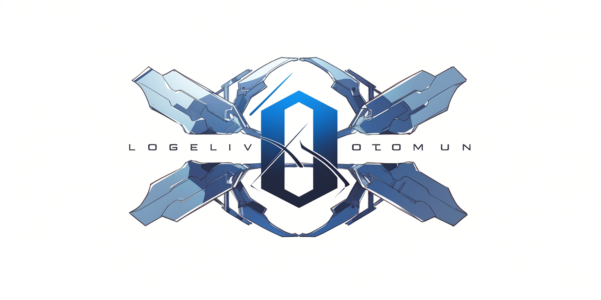

  

其它语言：[English](README.md)

# open-power

本仓库用于记录在生产力/性能/稳定/设计等因素中，有某一方面处于优良水平的开源项目。包括但不限于人工智能，区块链，图形图像渲染，图形图像，算法，模型，设计文档，标准文档，程序框架的收集。

# index
- [目录](#index)
- [人工智能](#ai)
- [编程开发](#dev)
- [开源字体](#font)

# AI

## 工具

|项目简要|地址|协议|
|--|--|--|
|Stable-diffusion-webui可以一键构建web页面，让stable-diffusion变成傻瓜式产品|https://github.com/AUTOMATIC1111/stable-diffusion-webui|AGPL 3.0|

## 算法框架

|项目简要|地址|协议|
|Diffusers是用于生成图像、音频甚至分子的三维结构的最先进预训练扩散模型的首选库。|https://github.com/huggingface/diffusers|ALv2|

## 模型

|项目简要|地址|协议|
|--|--|--|
Stable Diffusion是目前最出名的文本到图像扩散模型|https://github.com/CompVis/stable-diffusion|MIT|
|X-Transformers 是一个简洁但功能齐全的变压器模型，被stable-diffusion在NLP领域应用 |https://github.com/lucidrains/x-transformers|MIT|

# DEV

## Golang

### 库

|Project Brief | URL | License|
|--|--|--|
|这是一个GO语言协程池库，本人稳定用于生产|https://github.com/panjf2000/ants|MIT|

# font

|项目简要|地址|协议|
|--|--|--|
|霞鹜文楷：适合正文阅读的开源中文字体 |https://github.com/lxgw/LxgwWenKai|OFL1.1|
